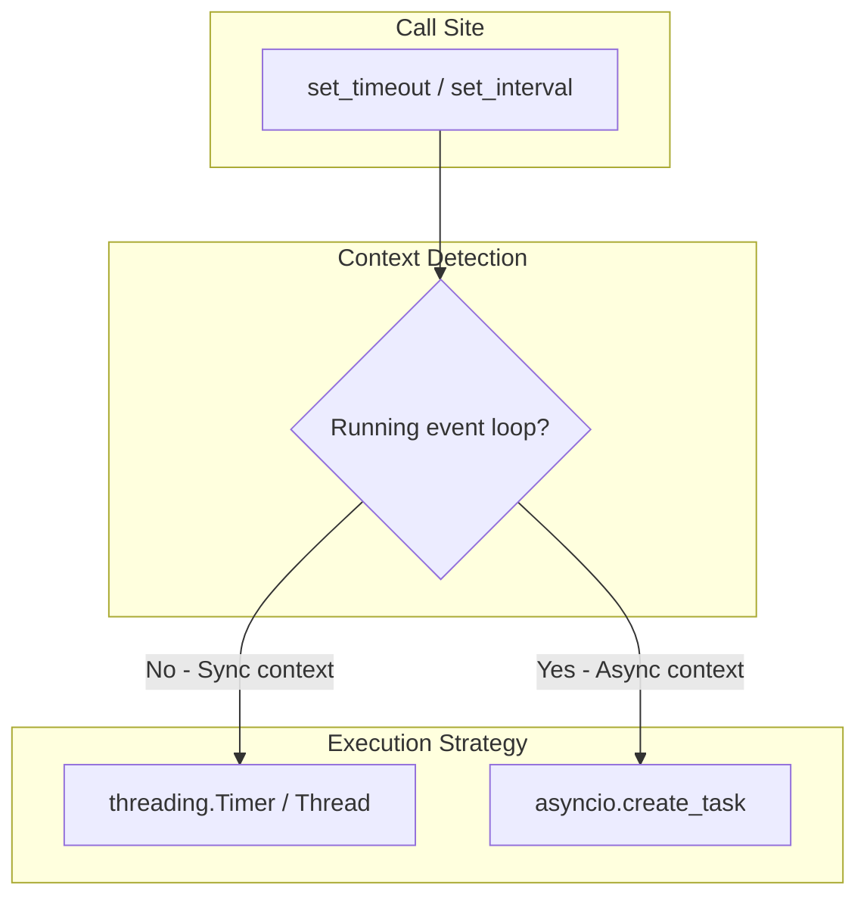

# SmartTimer - Non-Blocking Timers

The `smarttimer` module provides `setTimeout`/`setInterval` semantics (like JavaScript) that work transparently in both sync and async Python contexts.

## Overview



## Installation

`smarttimer` is included in `genro-toolbox`:

```bash
pip install genro-toolbox
```

## API

### set_timeout

Schedule a one-shot callback after `delay` seconds:

```python
from genro_toolbox import set_timeout

timer_id = set_timeout(2.0, print, "Hello!")
# "Hello!" printed after 2 seconds
```

### set_interval

Schedule a repeating callback every `delay` seconds:

```python
from genro_toolbox import set_interval, cancel_timer

timer_id = set_interval(1.0, print, "tick")
# "tick" printed every second until cancelled
cancel_timer(timer_id)
```

Use `initial_delay` to control the delay before the first execution (defaults to `delay`):

```python
# Check immediately (after 1s), then every 30s
tid = set_interval(30.0, check_status, initial_delay=1)
```

### cancel_timer

Cancel a pending timer by its ID. Returns `True` if the timer was found and cancelled, `False` otherwise:

```python
from genro_toolbox import set_timeout, cancel_timer

timer_id = set_timeout(10.0, expensive_task)
cancel_timer(timer_id)  # True — cancelled before firing
cancel_timer(timer_id)  # False — already gone
```

## Context Detection

The module automatically detects whether it's running in a sync or async context:

| Context | Timer mechanism | Callback: sync | Callback: async |
|---------|----------------|-----------------|-----------------|
| Sync | `threading.Timer` / `Thread` | Direct call | Temp event loop |
| Async | `asyncio.Task` | `asyncio.to_thread` | `await` |

## Real-World Examples

### Token refresh (inside a server/worker)

Renew an auth token before it expires, without blocking request handling:

```python
from genro_toolbox import set_timeout, cancel_timer

class TokenManager:
    def __init__(self, auth_client):
        self.auth_client = auth_client
        self._refresh_timer = None

    def on_token_received(self, token, expires_in):
        self.token = token
        # Schedule refresh 5 minutes before expiry
        if self._refresh_timer:
            cancel_timer(self._refresh_timer)
        self._refresh_timer = set_timeout(
            expires_in - 300, self._refresh
        )

    def _refresh(self):
        new_token = self.auth_client.refresh()
        self.on_token_received(new_token, new_token.expires_in)
```

### Heartbeat / keepalive (ASGI server)

Send periodic pings on a WebSocket connection:

```python
from genro_toolbox import set_interval, cancel_timer

class WebSocketHandler:
    def __init__(self, ws):
        self.ws = ws
        self._heartbeat = None

    async def on_connect(self):
        self._heartbeat = set_interval(30.0, self.ws.send_json, {"type": "ping"})

    async def on_disconnect(self):
        if self._heartbeat:
            cancel_timer(self._heartbeat)
```

### Job polling (async worker)

Poll a job queue and stop when the job completes:

```python
from genro_toolbox import set_interval, cancel_timer

pollers = {}

async def check_job(job_id):
    status = await api.get_job_status(job_id)
    if status in ("completed", "failed"):
        cancel_timer(pollers.pop(job_id))
        await handle_result(job_id, status)

def start_polling(job_id):
    pollers[job_id] = set_interval(5.0, check_job, job_id)
```

### Cache invalidation (sync WSGI server)

Periodically clear a cache while the server is running:

```python
from genro_toolbox import set_interval

def setup_cache(app):
    app.cache = {}
    set_interval(60.0, app.cache.clear)
```

## Timer IDs

Each timer gets a unique 22-character ID (from `get_uuid`), suitable for logging and tracking:

```python
tid = set_timeout(5.0, callback)
print(tid)  # e.g., "Z00005KmLxHj7F9aGbCd3e"
```

## Thread Safety

The timer registry is protected by a lock. Creating and cancelling timers is safe from any thread.

## Note on Standalone Scripts

In sync standalone scripts (no server/framework), the process must stay alive for timers to fire — daemon threads die when the main thread exits. Inside servers, workers, or async event loops the process is already alive and timers work as expected.
